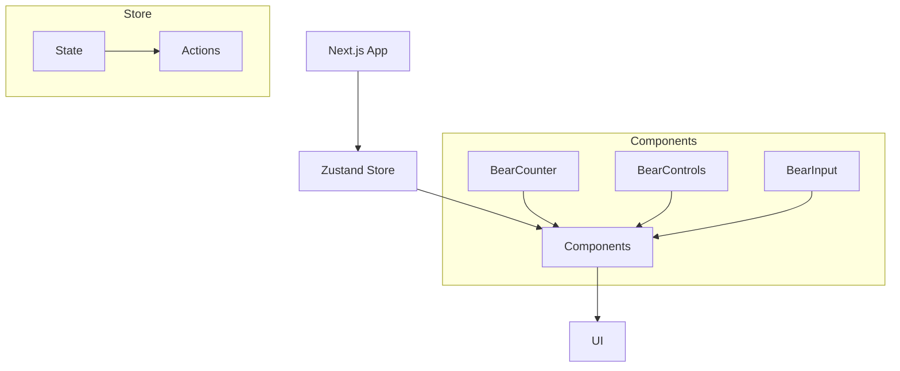

# System Patterns: Next.js + Zustand Boilerplate

## System Architecture
The application follows a simple but effective architecture:



## Key Technical Decisions

### 1. State Management with Zustand
- **Single Store Pattern**: Using a single Zustand store for the entire application
- **Selective Subscription**: Components subscribe only to the parts of the state they need
- **Action-Based Updates**: State is modified through defined actions, not directly

### 2. Component Structure
- **Functional Components**: All components are React functional components
- **Client Components**: Using "use client" directive for client-side interactivity
- **Component Separation**: Each UI element is its own component with a single responsibility

### 3. Next.js App Router
- Using the modern App Router pattern from Next.js
- Page component defined in `app/page.tsx`
- Layout defined in `app/layout.tsx`

## Design Patterns

### 1. Store Pattern
```typescript
// Define type
interface StoreState {
  data: DataType;
  actions: ActionType;
}

// Create store
const useStore = create<StoreState>((set) => ({
  data: initialData,
  actions: {
    updateData: () => set((state) => ({ data: newData }))
  }
}));
```

### 2. Selector Pattern
```typescript
// Subscribe to specific state slice
const specificData = useStore((state) => state.data.specific);

// Subscribe to specific actions
const { updateData } = useStore((state) => ({
  updateData: state.actions.updateData
}));
```

### 3. Component Patterns
- **Display Components**: Components that only display state (BearCounter)
- **Control Components**: Components that trigger state changes (BearControls)
- **Input Components**: Components that accept user input to update state (BearInput)

## Component Relationships
- **ZustandDemo**: Parent component that organizes the demo
- **BearCounter**: Displays the current bear count from the store
- **BearControls**: Provides buttons to modify the bear count
- **BearInput**: Allows direct input of a new bear count

Each component connects directly to the store and operates independently, demonstrating the decoupled nature of the Zustand pattern.
